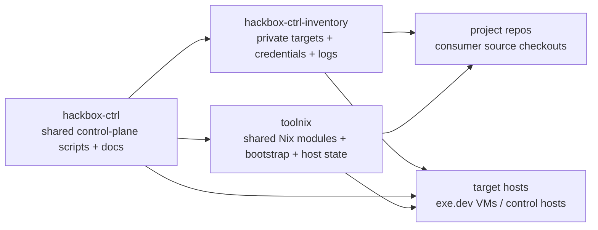

# hackbox-ctrl

Standalone control-plane toolkit for `toolnix`-managed hackboxes.

This repo is the shared operator-facing layer around provisioning, readiness,
and inventory-driven host operations. It is also the best high-level entrypoint
for understanding how the three active repos fit together.

## Repo relationship



### Ownership boundaries

- `hackbox-ctrl`
  - shared control-plane scripts
  - shared architecture/spec/reference docs
  - readiness and provisioning workflow
- `hackbox-ctrl-inventory`
  - private target manifests
  - local credentials and machine-specific runtime inputs
  - operational logs and per-target notes
- `toolnix`
  - shared Nix/devenv/Home Manager implementation
  - tracked bootstrap entrypoints
  - shared agent/shell/tmux baseline

It does **not** own:

- generic shared Nix environment logic — that lives in
  [`toolnix`](https://github.com/lefant/toolnix)
- private target facts, credentials, and logs — those live in the separate
  local `hackbox-ctrl-inventory` checkout

## Current local layout

```text
~/git/lefant/hackbox-ctrl/
├── scripts/
├── docs/
└── hackbox-ctrl-inventory/ -> ~/git/lefant/hackbox-ctrl-inventory
```

The scripts in this repo assume that nested layout by default. Override it with
`HACKBOX_CTRL_INVENTORY_ROOT` if needed.

## What lives here

- `scripts/` — tracked shared control-plane scripts
- `docs/specs/` — control-plane and readiness requirements
- `docs/decisions/` — durable architecture decisions
- `docs/reference/` — operator-facing validation notes
- `docs/plans/` — active implementation plans
- `docs/devlog/` — dated implementation outcomes

## What the nested inventory checkout provides

The local `hackbox-ctrl-inventory/` checkout is the composition root for
instance-specific state.

Expected examples there include:

- `targets/<fqdn>/config.env`
- `credentials/shared/env.toolnix`
- `credentials/targets/<fqdn>/env.toolnix.fragment`
- local secret material such as shared agent auth and SSH keys
- target-specific logs under `logs/`

This repo intentionally does not track those private inputs.

## Operator rule

After any meaningful fleet or host operation that changes machine state,
inventory metadata, or operator knowledge:

1. add or update a dated inventory log in `hackbox-ctrl-inventory/logs/`
2. commit the relevant `hackbox-ctrl-inventory` changes
3. push `hackbox-ctrl-inventory` so the operational record is current

Do not leave important rollout, cleanup, provisioning, migration, or recovery
work only in local shell history or chat context.

## Recent changes across the stack

### hackbox-ctrl

Recent shared control-plane changes documented here include:

- standalone-repo convergence and clearer repo-boundary docs
- host-only `toolnix` provisioning via `scripts/provision-toolnix-host.sh`
- remote-flake bootstrap proof for fresh hosts without target-side shared repo
  clones
- cache-backed `devenv` bootstrap proof after the Home Manager baseline is
  active
- checkout-path guidance standardized around `~/git/lefant/...`

See especially:

- `docs/devlog/2026-03-30-hackbox-ctrl-convergence.md`
- `docs/devlog/2026-03-31-standalone-rollout-follow-up.md`
- `docs/devlog/2026-04-05-remote-flake-host-bootstrap.md`

### hackbox-ctrl-inventory

Recent private-inventory changes visible from its tracked docs/logs include:

- docs cleaned up to stop treating old `hackbox-ctrl-utils` paths as primary
- completeness audit of the standalone control-plane split
- rollout and cleanup notes for migrated `toolnix` hosts
- target-specific migration records under `logs/`

Useful entrypoints there:

- `hackbox-ctrl-inventory/README.md`
- `hackbox-ctrl-inventory/logs/2026-03-31-hackbox-ctrl-completeness-audit.md`
- `hackbox-ctrl-inventory/logs/2026-03-31-toolnix-rollout-and-host-cleanup.md`

### toolnix

Recent shared Nix-layer changes documented in `toolnix` include:

- remote flake bootstrap as the preferred fresh-host entrypoint
- published bootstrap artifact and public flake interfaces
- cache/bootstrap guidance for `llm-agents.nix`
- restored opinionated zsh completion defaults and verification

Start with:

- `../toolnix/README.md`
- `../toolnix/docs/reference/architecture.md`
- `../toolnix/docs/devlog/2026-04-05-remote-host-bootstrap-script.md`
- `../toolnix/docs/devlog/2026-04-07-zsh-completion-defaults.md`

## Common commands

Provision or reprovision a project target VM from the standalone repo:

```bash
scripts/provision-exe-dev-nix.sh <target-fqdn>
```

Provision a host-only `toolnix` target with no target-side `toolnix` git clone:

```bash
scripts/provision-toolnix-host.sh <target-fqdn>
```

SSH to a configured target using inventory target metadata:

```bash
scripts/target-ssh.sh <target-name-or-fqdn>
```

Install and configure Tailscale on a target using inventory-managed inputs:

```bash
scripts/setup-target-tailscale.sh <target-fqdn>
```

Print the interactive readiness procedure for a general machine:

```bash
scripts/verify-general-machine-readiness.sh <target-name>
```

Print the interactive readiness procedure for the control host:

```bash
scripts/verify-control-host-readiness.sh [target-name]
```

## Current model

### Project-target path

The active project-target host-native path is:

1. read target metadata from `hackbox-ctrl-inventory`
2. place credentials and bootstrap inputs on the target
3. clone only the declared project repo into `MAIN_REPO_DIR`
4. invoke the tracked `toolnix` bootstrap script on the target
5. consume `toolnix` through its remote flake interface for Home Manager-managed host state
6. install `devenv` after that cache-backed host baseline is active
7. run smoke tests and then interactive acceptance checks

Important distinction:

- the project-target path still clones the declared project repository
- if that declared project repository happens to be `lefant/toolnix`, then the target will of course get a normal working checkout at `MAIN_REPO_DIR`
- that is not the old shared bootstrap dependency model
- the path no longer requires target-side shared clones of `toolnix`, `agent-skills`, or `claude-code-plugins`
- normal editable repo checkouts should use the `~/git/lefant/...` convention rather than reviving the older `~/sources/...` mirror pattern
- no target-side clone of `hackbox-ctrl` is required for provisioning or readiness

### Host-only toolnix path

The host-only bootstrap path is:

1. read target metadata from `hackbox-ctrl-inventory`
2. place credentials and bootstrap inputs on the target
3. inject machine-local files such as `~/.env.toolnix` and shared agent auth state from the control host
4. invoke the tracked `toolnix` bootstrap script on the target
5. consume `toolnix` through its remote flake interface
6. activate persistent host state via `toolnix.homeManagerModules.default`
7. run host-bootstrap readiness checks without requiring a project checkout

## Start here

Recommended reading order:

- `docs/specs/hackbox-ctrl-inventory-architecture.md`
- `docs/specs/project-environment-manifest.md`
- `docs/specs/control-host-and-target-agent-readiness.md`
- `docs/reference/readiness-validation.md`
- `docs/plans/2026-03-30-hackbox-ctrl-convergence.md`
