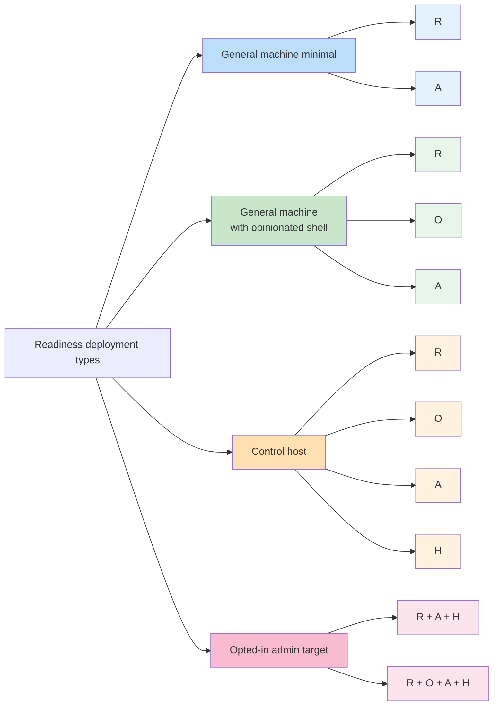

# Readiness Validation

This note defines how readiness checks should be grouped and applied after the `A/R/O/H` bucket regrouping.

## Principle

Not every readiness requirement should be automated in the same way, and not every deployment type should carry every bucket.

- **Smoke tests** are for fast, deterministic checks suitable for provisioning-time execution and cheap regression checks.
- **Interactive acceptance** is for shell, tmux, alias, and live-agent behavior that is better validated by a coding agent or operator over SSH.

The first question is now:

1. which bucket is this behavior in?
2. which deployment type enables that bucket?
3. should this behavior be proven by smoke tests, interactive acceptance, or both?

## Source Of Truth

- bucket model:
  - `docs/decisions/2026-03-26_adopt-shared-nix-bucket-layering.md`
- readiness expectations:
  - `docs/specs/control-host-and-target-agent-readiness.md`

## Deployment Types

| Deployment type | Buckets expected |
| --- | --- |
| General machine minimal | `R + A` |
| General machine with opinionated shell | `R + O + A` |
| Control host | `R + O + A + H` |
| Opted-in admin target | `R + A + H` or `R + O + A + H` |

## Current Tooling

- `scripts/lib/smoke-tests.sh`
  - shared smoke-test library used by the provisioners
  - best for deterministic `R` and `A` checks, and a small subset of `H`
- `scripts/verify-general-machine-readiness.sh <target-name>`
  - prints the canonical interactive acceptance procedure for a general machine target
- `scripts/verify-control-host-readiness.sh [target-name]`
  - prints the canonical interactive acceptance procedure for the active control host

## Bucket Grouping

### `R`: Required Shell/System Baseline

Applies to:
- general machine minimal
- general machine with opinionated shell
- control host
- opted-in admin target

Smoke-test candidates:
- target reachable enough to run deterministic commands
- `GH_TOKEN` present during provisioning
- `GH_TOKEN` sufficient for repo pull/push workflow
- required binaries present: `git`, `gh`, `tmux`, `bat`, `just`, `mg`
- UTF-8 locale present

Interactive-acceptance candidates:
- `gh auth status`, `git pull`, `git push` in the actual checked out repository
- control-host repo workflow in `~/git/lefant/hackbox-ctrl-inventory`

### `O`: Opinionated Shell Baseline

Applies to:
- general machine with opinionated shell
- control host
- opted-in admin target when opinionated shell is enabled

Notes:
- Stockholm `TZ` is treated as `O`, but is expected by default in Home Manager and `devenv`
- automatic `direnv` activation is not part of the default shell baseline

Smoke-test candidates:
- narrow deterministic checks such as:
  - `TZ=Europe/Stockholm`
  - host shell `date` not resolving to UTC

Interactive-acceptance candidates:
- `e` alias behavior
- `echo $TZ` and `date`
- `type e` shows an editor command at least equivalent to `mg -n`
- `tmux-here` behavior
- tmux starts without config warnings
- tmux status-bar clock shows Stockholm time
- the active `tmux-here` server actually has `extended-keys=on` and `extended-keys-format=csi-u`, not just the declarative config on disk
- `TMUX_COLOUR` is set
- tmux status bar is visibly not default green
- `claude` and `codex` wrapper aliases behave as intended

Explicit non-goals for default readiness:
- proving automatic `direnv` shell-hook activation
- relying on `~/.zsh/zshlocal.sh` for routine baseline behavior

### `A`: Agent Baseline

Applies to:
- general machine minimal
- general machine with opinionated shell
- control host
- opted-in admin target

Smoke-test candidates:
- agent binaries present
- auth-backed minimal prompt execution for Claude, Codex, and Pi
- shared skills tree present
- exact Pi keybinding config for newline, submit, and follow-up queue

Interactive-acceptance candidates:
- Pi starts and is usable interactively
- Pi does not emit missing-auth or missing-credential warnings before ordinary use
- Pi keybindings support:
  - newline via `ctrl-j`, `ctrl-m`, `shift-enter`, `alt-enter`, and `enter`
  - submit via `alt-j` and `alt-m`
  - follow-up queue via `alt-q`
  - restore queued messages via `alt-up` and `alt-p`
  - queue-follow-up must be proven with live keystrokes in an attached terminal session; do not claim it from config presence or `tmux send-keys` alone
- Claude and Codex render readable UTF-8-capable prompts
- wrapper alias behavior for Claude and Codex
- Codex starts without workspace-trust blockers in the project repo
- multiline entry behavior in Claude and Codex using `ctrl-j`, `ctrl-m`, and `shift-enter`, to the degree supported by the current CLI builds
- custom-skill usability inside a real session
- Claude slash-command availability only if that capability is explicitly in scope for the target under test

### `H`: Host/Control-Only Baseline

Applies to:
- control host
- opted-in admin target only when explicitly configured for management behavior

Smoke-test candidates:
- management credentials present on machines that explicitly opt in
- management credentials absent from ordinary non-management targets

Interactive-acceptance candidates:
- `tmux-meta` startup
- neutral white `tmux-meta` status bar
- target-entry alias behavior
- SSH-based control-host workflows
- fleet-management agent workflows
- `exe-dev-fleet` skill availability
- real system-overview execution

## Validation Matrix

| Bucket | General machine minimal | General machine with opinionated shell | Control host | Opted-in admin target |
| --- | --- | --- | --- | --- |
| `R` | Yes | Yes | Yes | Yes |
| `O` | No | Yes | Yes | Optional |
| `A` | Yes | Yes | Yes | Yes |
| `H` | No | No | Yes | Optional |

## What Belongs In Smoke Tests

Smoke tests are the right tool for:

- deterministic `R` checks
- deterministic `A` checks
- narrow presence/absence checks for `H` where appropriate

Smoke tests are not intended to prove:

- tmux status-bar visuals
- tmux startup cleanliness such as absence of config warnings
- tmux nested-session ergonomics
- alias expansion in a real interactive shell
- first-run prompt quality for live agent sessions
- absence of workspace-trust prompts in normal interactive Codex startup
- operator feel of a control-host workflow
- full fleet-management behavior

## What Belongs In Interactive Acceptance

Interactive acceptance is the right tool for:

- `O` behaviors by default
- session-shaped `A` proof
- practically all `H` behaviors except simple presence/absence checks

Typical examples:

- shell alias and editor behavior such as `type e` and `which mg`
- Stockholm time as actually experienced in tmux and shell
- tmux startup cleanliness, status-bar color, and clock behavior
- nested `tmux-meta` and `tmux-here` workflows
- live Claude, Codex, and Pi usability, including absence of first-run blockers such as Codex workspace-trust prompts
- custom-skill usability inside an actual agent session
- target-entry alias behavior on the control host
- exe.dev fleet workflows driven by a real agent session

## Usage During Provisioning

Provisioners should:

1. determine the deployment type and therefore the expected bucket set
2. run the relevant smoke tests for the enabled buckets
3. point the operator or coding agent at the relevant interactive verification script for the remaining checks

Provisioning should not claim that every interactive requirement has been automatically proven.
